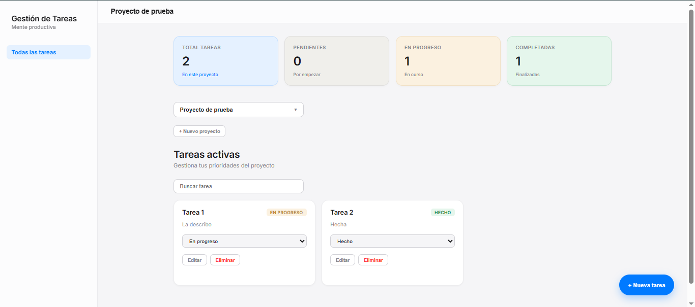
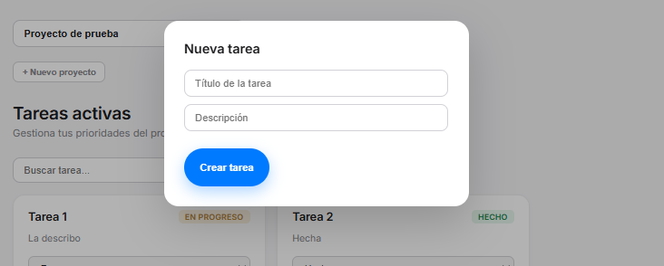
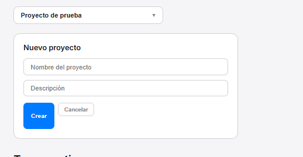

# 🗂️ Gestión de Tareas — Full Stack Application


Aplicación Full Stack para la gestión de proyectos y tareas desarrollada con **Spring Boot**, **Arquitectura Hexagonal**, **Domain Driven Design (DDD)** y **React**.

El proyecto implementa una separación clara entre dominio, aplicación e infraestructura en el backend, junto con una interfaz moderna desarrollada en React que consume una API REST. Su objetivo es demostrar buenas prácticas de desarrollo de software, diseño de arquitecturas desacopladas y construcción de aplicaciones web modernas.

---

## 📑 Índice

* Capturas
* Estructura del repositorio
* Arquitectura
* Características técnicas
* Backend
* Frontend
* Instalación y ejecución
* Retos y aprendizajes
* Mejoras futuras
* Autor

---

## 📸 Capturas

### Dashboard



### Gestión de tareas



### Creación y edición de proyectos



---

## 📁 Estructura del repositorio

```text
gestion-tareas-fullstack/
├── backend/     # API REST en Spring Boot
└── frontend/    # Aplicación React
```

---

## 🏛️ Arquitectura

El backend sigue una **Arquitectura Hexagonal (Ports & Adapters)** junto con principios de **Domain Driven Design (DDD)**.

```text
React Frontend
       │
       ▼
 REST Controllers
       │
       ▼
   Casos de Uso
       │
       ▼
     Dominio
       │
       ▼
 Puertos de Salida
       │
       ▼
 Adaptadores JPA
       │
       ▼
   PostgreSQL
```

El dominio permanece completamente aislado de Spring, JPA y cualquier dependencia externa, permitiendo una mayor mantenibilidad, facilidad de testeo y desacoplamiento tecnológico.

---

## 📊 Características técnicas

* Arquitectura Hexagonal (Ports & Adapters)
* Domain Driven Design (DDD)
* API REST documentada con Swagger/OpenAPI
* Persistencia de datos con PostgreSQL
* Tests unitarios con JUnit 5 y Mockito
* Validación de datos con Jakarta Validation
* Manejo global de excepciones
* Frontend React consumiendo API REST
* Diseño responsive adaptado a distintos dispositivos

---

# 🏗️ Backend

API REST desarrollada con Spring Boot siguiendo una separación estricta entre dominio, aplicación e infraestructura.

```text
com.gestiontareas/
├── domain/
│   ├── model/
│   ├── port/
│   │   ├── in/
│   │   └── out/
│   └── exception/
├── application/
│   └── service/
└── infrastructure/
    ├── persistence/
    └── web/
```

### Tecnologías Backend

* Java 21
* Spring Boot 3
* Spring Data JPA
* PostgreSQL
* JUnit 5
* Mockito
* Swagger/OpenAPI

### Funcionalidades Backend

* CRUD completo de usuarios
* CRUD completo de proyectos
* CRUD completo de tareas
* Relaciones entre proyectos y tareas
* Eliminación en cascada de tareas asociadas a un proyecto
* Validación de datos mediante Jakarta Validation
* Gestión centralizada de excepciones mediante `@RestControllerAdvice`
* Tests unitarios de dominio y casos de uso
* Documentación automática de la API mediante Swagger

### Ejecutar Backend

```bash
cd backend
```

Crear la base de datos:

```sql
CREATE DATABASE gestiontareas;
```

Configurar las credenciales de PostgreSQL en:

```text
src/main/resources/application.properties
```

Iniciar la aplicación:

```bash
./mvnw spring-boot:run
```

La API estará disponible en:

```text
http://localhost:8080
```

Swagger UI:

```text
http://localhost:8080/swagger-ui/index.html
```

---

# 💻 Frontend

Interfaz desarrollada con React y Vite que consume la API REST del backend y proporciona una experiencia de usuario moderna para la gestión de proyectos y tareas.

### Tecnologías Frontend

* React 18
* Vite
* JavaScript ES6+
* CSS3

### Funcionalidades Frontend

* Dashboard con métricas de tareas en tiempo real
* Gestión de proyectos
* Creación de tareas mediante modal
* Edición de tareas existentes
* Eliminación de tareas
* Cambio de estado desde la propia interfaz
* Búsqueda de tareas en tiempo real
* Diseño responsive
* Sidebar de navegación persistente

### Ejecutar Frontend

```bash
cd frontend

npm install
npm run dev
```

La aplicación estará disponible en:

```text
http://localhost:5173
```

El frontend requiere que el backend esté ejecutándose en:

```text
http://localhost:8080
```

con CORS configurado para dicho origen.

---

## 🚀 Retos y aprendizajes

Durante el desarrollo de este proyecto trabajé conceptos habituales en aplicaciones empresariales reales:

* Diseño e implementación de una Arquitectura Hexagonal.
* Aplicación de principios de Domain Driven Design (DDD).
* Desarrollo de una API REST desacoplada del framework.
* Construcción de una SPA con React.
* Gestión de estado mediante hooks y props.
* Integración entre frontend y backend mediante CORS.
* Escritura de tests unitarios para dominio y aplicación.
* Organización de código orientada a mantenibilidad y escalabilidad.
* Resolución de incidencias relacionadas con configuración, despliegue y control de versiones.

---

## 🔮 Mejoras futuras

* Autenticación y autorización mediante JWT.
* Gestión de roles y permisos.
* Dockerización completa de la aplicación.
* Tests de integración.
* Pipeline CI/CD.
* Despliegue cloud.
* Sistema de notificaciones.
* Filtros avanzados de búsqueda y clasificación.

---

## 👨‍💻 Autor

**Francisco José Soria Navarrete**

Desarrollador Full Stack especializado en Java y desarrollo web.

* GitHub: https://github.com/AirooSs
* LinkedIn: https://www.linkedin.com/in/fran-soria-nav/
